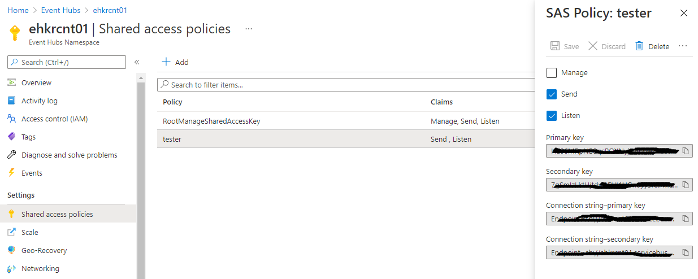
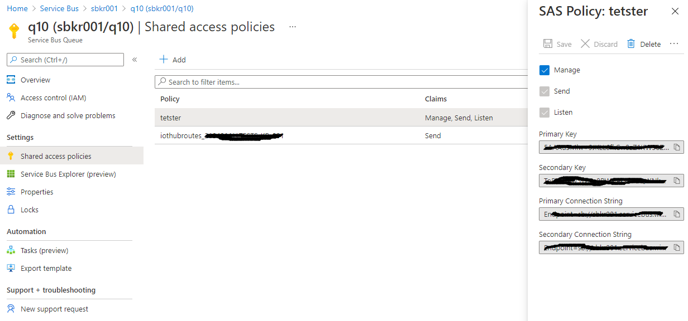

# az-measaging-test

Test clients for Azure messaging services for verifying the architecture - Azure IoT Hub, Event Hub, Service Bus

## Prerequisites

- JDK 1.8.X
- Maven 3.X+

Ensure JAVA_HOME and PATH with JAVA_HOME/bin and maven home/bin

## How to build

	mvn clean package

After package's done successfully, all dependencies are copied into target/ext. Check 'copy-dependencies' in pom.xml

## How to config

Rename config.properties-sample to config.properties and fill out all neccesary attributes that you're gonna need to run the test

config.properties-sample
	
	## event hub reciever config
	
	# connection string that you can get from SAS Policy of your EH instance
	eventhub.receiver.connection-string=
	# your instance name to run the test to
	eventhub.receiver.eventhub-name=
	# connection string where to pop the messages from. you can get this from SAS Policy of your storage instance
	eventhub.receiver.storage-connection-string=
	# blob storage container name where to put the events to
	eventhub.receiver.storage-container-name=
	# count of receiver clients to run concurrently
	eventhub.receiver.clients=1
	
	## event hub sender
	
	# connection string that you can get from SAS Policy of your EH instance
	eventhub.sender.connection-string=
	# your instance name to run the test to
	eventhub.sender.eventhub-name=
	# interval per sends
	eventhub.sender.interv-per-send=1000
	# messages per clients
	eventhub.sender.messages-per-client=100
	# interval per clinets, use it for ramp ups
	eventhub.sender.interv-per-client=1000
	# count of sender clients to run concurrently 
	eventhub.sender.clients=1
	# size of message to send
	eventhub.sender.data-length=64
	
	## servicebus subscriber
	
	# connection string that you can get from SAS Policy of your SB instance
	servicebus.subscriber.connection-string=
	# your instance name to run the test to
	servicebus.subscriber.queue-name=
	# count of subsriber clients to run concurrently
	servicebus.subscriber.clients=1
	
	## servicebus publisher
	
	# connection string that you can get from SAS Policy of your SB instance
	servicebus.publisher.connection-string=
	# your instance name to run the test to
	servicebus.publisher.queue-name=
	# interval per sends
	servicebus.publisher.interv-per-send=1000
	# messages per clients
	servicebus.publisher.messages-per-client=100
	# interval per clinets, use it for ramp ups
	servicebus.publisher.interv-per-client=1000
	# count of sender clients to run concurrently 
	servicebus.publisher.clients=1
	# size of message to send
	servicebus.publisher.data-length=64
	
	## iothub service
	
	# get this value by running this after 'az login' from command line
	# az iot hub show --query properties.eventHubEndpoints.events.endpoint --name {your IoT Hub name}
	iothub.service.endpoint=
	# az iot hub show --query properties.eventHubEndpoints.events.path --name {your IoT Hub name}
	iothub.service.hub-path=
	# az iot hub policy show --name service --query primaryKey --hub-name {your IoT Hub name}
	iothub.service.sas-key=
	# name of your SAS key
	iothub.service.sas-keyname=
	# count of subsriber clients to run concurrently	
	iothub.service.clients=1
	
	## iothub client
	
	# filename where your device ids are stored
	iothub.client.devicefile=devices.txt
	# messages per clients
	iothub.client.interv-per-send=1000
	# interval per sends
	iothub.client.messages-per-client=100
	# interval per clinets, use it for ramp ups
	iothub.client.interv-per-client=1000
	# count of sender clients to run concurrently 
	iothub.client.clients=1
	# size of message to send
	iothub.client.data-length=64
	
	## common config
	
	# mark "***" when the laptime's over than this value
	common.mark.over=500

Selectively config these only what you need to test

## How to run

Running IoT Hub Client 

	mvn exec:java -Dexec.mainClass="com.eg.az.test.iothub.Client"

Running IoT Hub Service

	mvn exec:java -Dexec.mainClass="com.eg.az.test.iothub.Service"

Running ServiceBus Publisher

	mvn exec:java -Dexec.mainClass="com.eg.az.test.servicebus.Publisher"

Running ServiceBus Subscriber

	mvn exec:java -Dexec.mainClass="com.eg.az.test.servicebus.Subscriber"

Running Event Hub Sender

	mvn exec:java -Dexec.mainClass="com.eg.az.test.eventhub.Sender"

Running Event Hub Receiver

	mvn exec:java -Dexec.mainClass="com.eg.az.test.eventhub.Receiver"

Or without maven for running these, you can create a shell script which adds all dependencies into the classpath of JVM runtime  

All message clients (Client, Publisher, Sender) send com.eg.az.test.common.TelemetryDataPoint with data as message contents

	package com.eg.az.test.common;
	
	import java.util.Random;
	
	import com.google.gson.Gson;
	
	public class TelemetryDataPoint {
		
		public double temperature;
		public double humidity;
		public long createdat;
		
		double minTemperature = 20;
		double minHumidity = 60;
		
		String data;

When it's created current time's automatically saved to createdat. data is message contents. TelemetryDataPoint gets data length then it generates randome string

## Azure Service Configuration 

### Event Hub

Create a 'tester' policy first and get connection string from your Event Hub to test

### Service Bus

Create a 'tester' policy first and get connection string from your ServiceBus to test

### IoT Hub

Check this document for the values that you're gonna need 'Quickstart: Send telemetry to an Azure IoT hub and read it with a Java application'  
https://docs.microsoft.com/en-us/azure/iot-hub/quickstart-send-telemetry-java

Device creation, after you logged in from command line

	az iot hub device-identity create --hub-name {your IoT hub instance name} --device-id MyJavaDevice

'MyJavaDevice' as your device id

Get Device Id, 

	az iot hub device-identity connection-string show --hub-name {your IoT hub instance name} --device-id MyJavaDevice --output table

Collect all connection strings for your devices and save into 'devices.txt' which's 'iothub.client.devicefile' in the configuration

